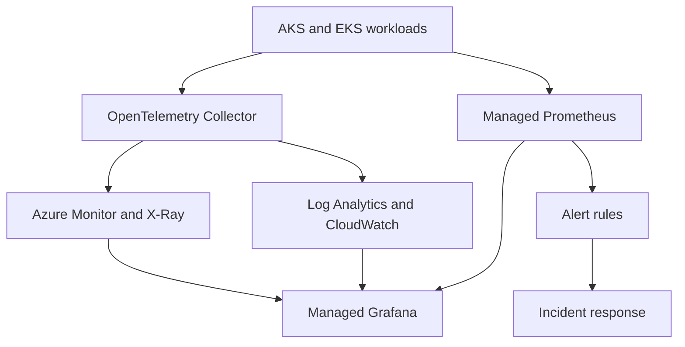

# Cloud Observability Platform

Production-minded, multi-cloud observability reference implementation for Azure Kubernetes Service (AKS) and Amazon Elastic Kubernetes Service (EKS). The project demonstrates how to combine infrastructure as code, metrics, logs, distributed traces, alerting, service-level objectives, dashboards, and incident response into one operating model.

## What this demonstrates

- Azure Monitor, Log Analytics, and Application Insights provisioned with Terraform
- Azure Managed Prometheus and Azure Managed Grafana integration for AKS
- Amazon CloudWatch, AWS X-Ray, Amazon Managed Service for Prometheus, and Amazon Managed Grafana provisioned with Terraform
- CloudWatch Container Insights and OpenTelemetry collection patterns for EKS
- OpenTelemetry Collector configuration for metrics, logs, and traces
- Prometheus recording and alerting rules for availability, latency, errors, and saturation
- SLI, SLO, and error-budget definitions for a customer-facing API
- Grafana dashboard-as-code for RED and Kubernetes golden signals
- Actionable alerts tied to a documented incident-response runbook
- CI validation for Terraform, YAML, and observability configuration

## Architecture

## Repository layout

| Path | Purpose |
| --- | --- |
| `terraform/azure/` | Azure observability resources and AKS monitoring integration |
| `terraform/aws/` | AWS observability resources and EKS monitoring integration |
| `kubernetes/` | OpenTelemetry Collector and Prometheus rule configuration |
| `slos/` | Service-level objectives and error-budget policy |
| `dashboards/` | Grafana dashboard-as-code |
| `runbooks/` | Evidence-driven incident triage and recovery procedures |
| `.github/workflows/` | Automated validation |

## Reliability model

The sample `checkout-api` uses four golden signals:

| Signal | Indicator | Objective |
| --- | --- | --- |
| Availability | Successful requests / total requests | 99.9% over 30 days |
| Latency | Requests completed under 500 ms | 95% over 30 days |
| Errors | HTTP 5xx request ratio | Below 1% |
| Saturation | CPU and memory utilization | Alert before sustained exhaustion |

The error budget for a 99.9% availability objective is approximately 43 minutes per 30-day window. Burn-rate alerts detect both rapid outages and slower reliability degradation.

## Deployment workflow

1. Authenticate to the target Azure subscription or AWS account using short-lived identity credentials.
2. Copy the relevant `terraform.tfvars.example` to `terraform.tfvars` and supply environment-specific values.
3. Run `terraform init`, `terraform validate`, and `terraform plan` in `terraform/azure` or `terraform/aws`.
4. Apply the reviewed plan through an approved CI/CD environment.
5. Deploy the OpenTelemetry Collector and Prometheus rules.
6. Import the Grafana dashboard and validate telemetry with a controlled test request.

## Operational validation

After deployment, verify that:

- AKS container logs are queryable in Log Analytics.
- EKS control-plane and workload signals are queryable in CloudWatch.
- Prometheus is scraping workload and cluster metrics.
- Application Insights or AWS X-Ray receives trace spans and dependency telemetry.
- Grafana panels populate for request rate, error rate, duration, and saturation.
- A controlled alert reaches the expected action group.
- Alert annotations link responders to the correct runbook.

## Security and cost controls

- Uses managed identities instead of embedded credentials.
- Keeps example values and secrets out of source control.
- Supports diagnostic retention and daily ingestion caps.
- Treats dashboards, rules, and runbooks as reviewed code.
- Recommends least-privilege Azure RBAC for operators and dashboard viewers.

## Notes

This repository contains sanitized reference patterns intended for portfolio and learning use. It does not include employer or customer proprietary code. Validate resource names, provider versions, regional availability, alert thresholds, and cost settings before production use.
